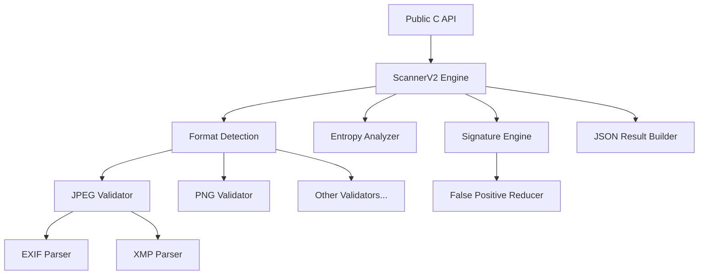

# SafeImg v2.0

**Secure, Language-Independent Image Scanning Library**

SafeImg is a high-performance, cross-platform C++17 shared library designed to detect malicious content, structural anomalies, and privacy threats in image files. It provides a clean C API, making it easy to integrate into any application or backend service.

[](LICENSE)
[](https://en.cppreference.com/w/cpp/17)
[](https://cmake.org/)

---

## ✨ Features

- **Zero External Dependencies**: Pure standard C++17 implementation.
- **Cross-Platform**: Native support for Linux, macOS, and Windows.
- **Thread-Safe**: Designed for high-concurrency environments with no global state.
- **Memory Safe**: Strict ownership semantics and resource management.
- **JSON Output**: Standardized, machine-readable scan results.
- **Configurable**: Adjustable thresholds, timeouts, and security strictness.

## 🖼️ Supported Formats

SafeImg validates structure and identifying markers for:

| Format | Magic Bytes | Validation Scope |
|--------|-------------|------------------|
| **JPEG** | `FF D8 FF` | Marker integrity, EXIF/XMP parsing, EOF check |
| **PNG** | `89 50 4E 47` | Chunk CRC32, IHDR/IEND validation, ancillary chunks |
| **WEBP** | `52 49 46 46` | RIFF container, VP8/VP8L/VP8X headers |
| **GIF** | `47 49 46 38` | Logical Screen Descriptor, block structure |
| **BMP** | `42 4D` | DIB header validation, compression checks |
| **TIFF** | `49 49` / `4D 4D` | IFD loop detection, tag validation |
| **SVG** | `<xml` / `<svg` | XML parsing, script/event-handler detection |

## 🛡️ Security Capabilities

- **Polyglot Detection**: Identifies files hiding ZIP, PDF, or HTML payloads within image structures.
- **Metadata Analysis**: Extracts and strictly validates EXIF, XMP, and IPTC data.
- **Privacy Protection**: Flags GPS coordinates and sensitive device information.
- **Entropy Analysis**: Detects encrypted payloads or steganography via Shannon entropy analysis.
- **Signature Matching**: Scans for known malware signatures, webshells, and exploit patterns.
- **False Positive Reduction**: Intelligent context analysis to distinguish legitimate data from threats.

---

## 📦 Installation

### Prerequisites
- CMake 3.10+
- C++17 compliant compiler (GCC 7+, Clang 5+, MSVC 2017+)

### Build Instructions

```bash
# Clone the repository
git clone https://github.com/organization/safeimg.git
cd safeimg

# Configure and build
mkdir build && cd build
cmake ..
make -j$(nproc)

# Install (optional)
sudo make install
```

**Artifacts**:
- Shared Library: `dist/lib/libsafeimg.so` (Linux), `.dylib` (macOS), `.dll` (Windows)
- Headers: `include/safeimg_export.h`

---

## 💻 Usage

### C Example

```c
#include "safeimg_export.h"
#include <stdio.h>
#include <stdlib.h>

int main() {
    const char* filepath = "upload.jpg";
    
    // Scan the file
    // Options can be passed as a JSON string, or NULL for defaults
    char* result_json = safeimg_scan_file(filepath, NULL);
    
    if (result_json) {
        printf("Scan Result: %s\n", result_json);
        
        // Critical: Free the memory allocated by the library
        safeimg_free(result_json);
    }
    
    return 0;
}
```

### C++ Example

```cpp
#include "safeimg_export.h"
#include <iostream>
#include <string>
#include <memory>

int main() {
    const std::string filepath = "avatar.png";
    const std::string options = R"({"checkIntegrity": true, "confidenceThreshold": 0.8})";

    // Scan
    char* raw_result = safeimg_scan_file(filepath.c_str(), options.c_str());
    
    if (raw_result) {
        std::cout << "Result: " << raw_result << std::endl;
        
        // Free
        safeimg_free(raw_result);
    }
    
    return 0;
}
```

---

## 📊 Scan Results

The library returns a comprehensive JSON object describing the scan findings:

```json
{
  "version": "2.0.0",
  "isSafe": false,
  "format": "jpeg",
  "realImageSize": 45032,
  "scanTimeMs": 12.5,
  "issues": [
    {
      "severity": "high",
      "type": "polyglot_detected",
      "description": "Embedded ZIP archive detected at offset 45000",
      "category": "structure"
    },
    {
      "severity": "warning",
      "type": "gps_data",
      "description": "GPS Geolocation data present",
      "category": "privacy"
    }
  ],
  "metadata": {
    "hasEXIF": true,
    "hasXMP": false,
    "hasGPS": true
  }
}
```

---

## ⚡ Performance

- **Throughput**: Processes >1,000 images/sec on modern hardware (concurrent).
- **Latency**: Sub-20ms scan time for typical web images (<5MB).
- **Memory Footprint**: Minimal overhead; default 0-copy I/O where supported.

---

## 🏗️ Architecture

SafeImg follows a layered architecture to separate the public API from the core engine:



---

## 📂 Project Structure

```
safeimg/
├── include/
│   └── safeimg_export.h      # Public API header
├── src/
│   ├── api/                  # C API Implementation
│   ├── core/                 # Core logic, validators, parsers
│   └── signatures/           # Signature engine & heuristics
├── dist/                     # Compiled binaries
├── docs/                     # Detailed documentation
└── test/                     # Integration tests
```

---

## 📝 Documentation

Detailed documentation is available in the `docs/` directory:

- [**Building Guide**](docs/BUILD.md) - Detailed cross-platform build instructions.
- [**C API Reference**](docs/API.md) - Complete function reference and memory management.
- [**Project Structure**](docs/STRUCTURE.md) - Deep dive into internal modules.

---

## 🤝 Contributing

Contributions are welcome!
1. Fork the repository.
2. Create your feature branch (`git checkout -b feature/amazing-feature`).
3. Commit your changes.
4. Push to the branch.
5. Open a Pull Request.

Please ensure all new code includes basic tests and follows the existing C++17 style.

---

## 📄 License

This project is licensed under the MIT License - see the [LICENSE](LICENSE) file for details.
